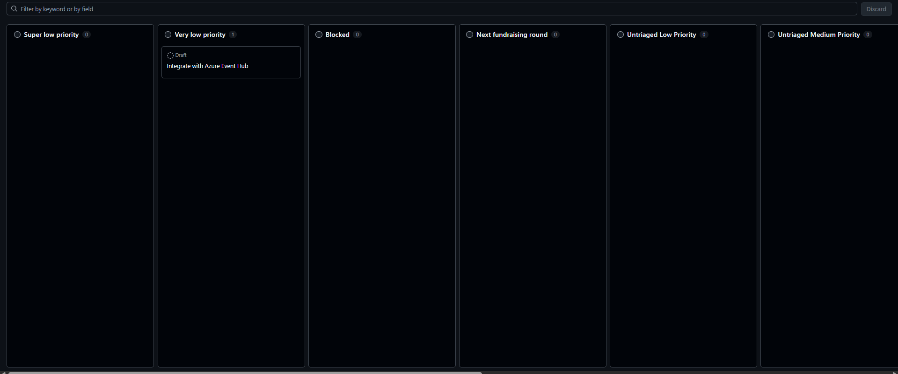
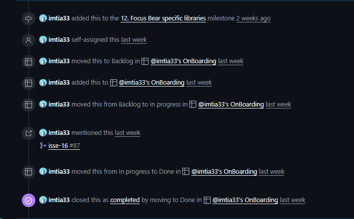

# Agile Workflows & Kanban

### How does Kanban help manage priorities and avoid overload?
Kanban visualizes priorities clearly. Since only a limited number of tasks can be “In Progress,” team members focus on finishing high-priority items before starting new ones. This prevents burnout and ensures steady progress on what matters most.

### How can you improve your workflow using Kanban principles?
I can improve my workflow by:
- Breaking large tasks into smaller, manageable cards.  
- Setting WIP limits to maintain focus.  
- Regularly reviewing the board to reprioritize and clear blockers.  
- Using labels or colors to indicate urgency or task type.

## Focus Bears kanban workflow:
Columns: 

Super low priority
Very low priority
Integrate with Azure Event Hub
Blocked
Next fundraising round
Untriaged Low Priority
Untriaged Medium Priority

## My experience in Kanban: 

