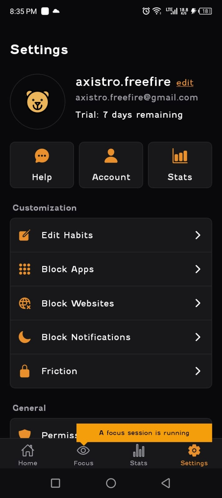

# Reason behind creation of Focus Bear:
  Focus Bear was created with a goal to help neurodivergent people staying focused, maintaining habbits and increase productivity. Focus Bear is created by people with neurodivergent for the neurodivergent people.

# The problem Focus Bear is Solving:
  The Focus Bear addresses some problems suck as :
  - Difficulty staying focused.
  - Helping to create and maintain an healthy habbit and routine.
  - Help people be more productive, taking self care, staying on tasksetc.

# Importance of the mission: 
 - Currently in the digital environment we face constant distractions. This makes focus and doing work is harder for people.
 - Neurodivergent individuals often face extra barriers — traditional apps may assume neurotypical patterns. Focus Bear’s purpose is inclusive of different brains.
 -If more people can build sustainable habits, handle distractions, and improve their routine, the quality of life and mental health outcomes can improve.

# Allignment of Focus Bear with my personal Values:
 - I easily get distracted. But in my mind I try to stay true to keep focus on the current task. Focus Bear helps me to block the distractions.
 - As a developer who is working on a app based on productivity helps me stay true to goal and maintain my own focus. 

# Personal Note: 
 - I sometimes find it difficult to stick to routines .
 - I build apps that require sustained attention, but periodic breaks and avoiding burnout are sometimes neglected. An app that reminds me or blocks distractions would help.

So I feel a personal linkage to the problems Focus Bear addresses.

# Features that are helpful to me:
 - App Blocking. Blocking games.
 - Site blocking. Blocking comics sites.

