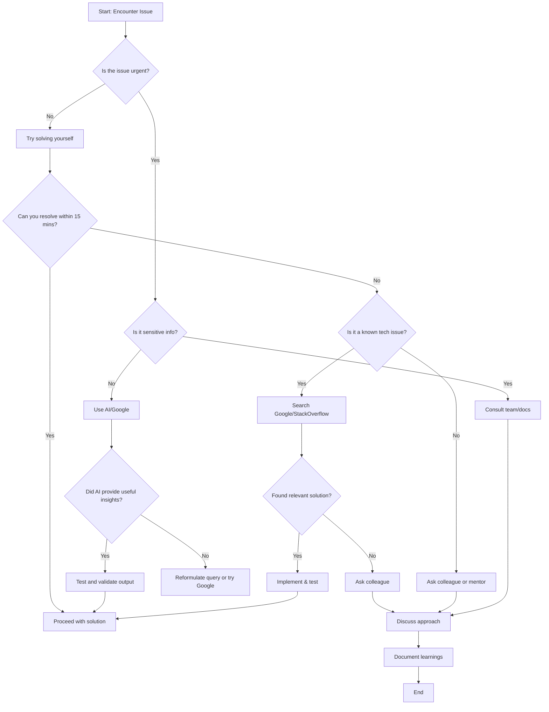

## Troubleshooting Coding Problems: Best Practices & Decision Framework

### Best Practices for Troubleshooting

1. **Break Down the Problem**: Isolate the issue by narrowing down the scope.
2. **Check Documentation**: Always start with official documentation.
3. **Reproduce the Issue**: Ensure you can consistently reproduce the error.
4. **Search Before Asking**: Use Google or Stack Overflow before seeking human help.
5. **Use Version Control**: Leverage Git to track changes and revert if necessary.
6. **Ask Smart Questions**: Provide context, code snippets, and error messages when asking for help.

---

### Reflection: AI vs. Google vs. Colleagues

#### When to Use AI Tools:
- For learning concepts or exploring multiple solution approaches.
- When working on non-sensitive data and prototyping.
- To get instant feedback during solo development sessions.

#### When to Search Google:
- For specific error messages or known bugs.
- To find community-driven solutions or real-world examples.
- When looking for libraries, frameworks, or tools that solve a particular problem.

#### When to Ask a Colleague:
- For complex logic or business-related decisions.
- When dealing with sensitive or proprietary code.
- If stuck for an extended period and need a fresh perspective.

#### Challenges Developers Face While Troubleshooting Alone:
- Lack of immediate feedback can lead to tunnel vision.
- Difficulty in explaining the problem clearly without peer interaction.
- Risk of over-relying on AI-generated solutions which may not always be accurate or optimal.

---

### Decision-Making Flowchart

