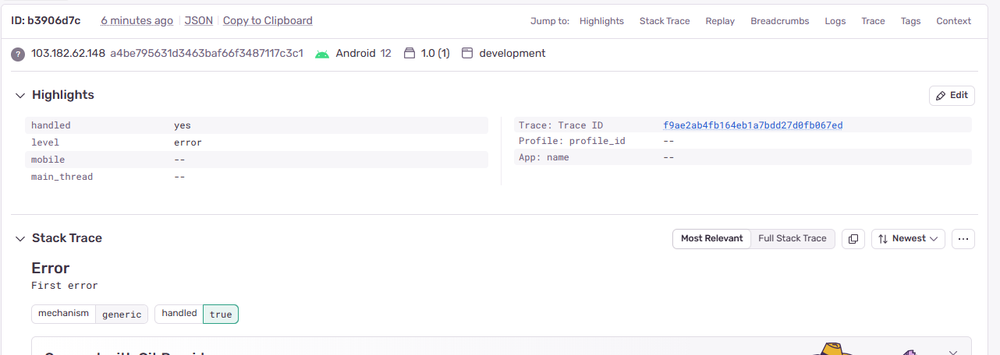

# Researching libraries used by focusbear 

1. `@react-navigation/native`, `@react-navigation/stack` , `@react-navigation/bottom-tabs` – Handles navigation


I am familier with these libraries as I used them in multiple projects for navigation setup.

2. `react-native-vector-icons` . Although I used this less than I used `Expo vector Icons` and `Lucide Icons` library.

3. `@rneui/themed` there was a version conflict with this library 
so I tested this on a snack. Link : https://snack.expo.dev/@arpitbhalla/react-native-elements

4. `react-native-gesture-handler` I am quite familier with this library as I used it in multiple projects for handling gestures, like swipe for bottom tabs change, bottom sheet, side bar etc. 

codeExample: https://github.com/imtia33/TravelMate/blob/16c97a9df363c0d72efa28f971e6ab0cc52aefcd/components/BottomSheet.jsx#L26


- except for the react-native-reanimated & and async storage the rest are new. Although I wont say most of them are new , becuase I made my own diy componants like a theme changer component which is done via '@rneui/themed'. As for the auth libraries , I could not test much becuase I dont have an IOS phone.

# Reflection


### 1. What is the purpose of **Redux-Persist**, and why is it useful?

**Purpose:**
Redux-Persist automatically saves (persists) parts of your Redux store to local storage (in React Native, usually `AsyncStorage`), so data remains available **after the app restarts**.

**Why it’s useful:**
Without it, your Redux state resets to the initial values every time the app reloads or closes.

###  2. How does **react-native-background-fetch** differ from a normal timer?

**Normal timers** (`setInterval`, etc.)

* Stop working when the app goes to background or the OS suspends it.

**react-native-background-fetch**

* Uses **native OS background job APIs** (Android `JobScheduler`, iOS `BGTaskScheduler`)


### 3. Why does **Focus Bear use Auth0** instead of handling authentication manually?

Because **Auth0** provides secure authentication without reinventing the wheel.

**benefits:**

* Built-in OAuth, social logins, and enterprise login providers.
* Securely stores credentials and prevents vulnerabilities.

---

### 4. How does **PostHog** help improve the user experience in Focus Bear?

**PostHog** is a **product analytics** tool that tracks user behavior to help developers understand how people actually use the app.

**It helps Focus Bear by:**

* Tracking feature usage (e.g., “How often do users start Focus sessions?”)
* Identifying drop-off points or confusing screens.
* Running **A/B tests** to measure which features improve engagement.
* Collecting **funnel data** to guide product decisions.


---

### ⚠️ 5. What’s the difference between **Sentry** and **PostHog**, and when would you use each?

| Tool        | Primary Purpose                    | Example Use                                      |
| :---------- | :--------------------------------- | :----------------------------------------------- |
| **Sentry**  | Error and crash reporting          | Detect when a screen crashes due to an exception |
| **PostHog** | Product analytics & usage tracking | Track how users interact with a new feature      |

**When to use:**

* Use **Sentry** to fix *bugs* (stability, stack traces, crashes).
* Use **PostHog** to improve *usability* (user flow, engagement, retention).

---

### 6. How does **react-native-localize** work, and how does it interact with **i18next**?

**react-native-localize** detects:

* The user’s device language, region, and timezone.
* Whether the language is right-to-left.

**i18next** is a translation management library.

They work together like this:

1. `react-native-localize` detects language → e.g. “bn-BD” or “en-US”.
2.  pass that language code to **i18next**.
3. i18next loads the correct translation JSON file and formats messages accordingly.

---

### 7. If you had to remove one library and replace it with an alternative, which one would you choose and why?

- Although I could not find any replacement as I have not seen the architecture that Focus Bear uses. I assume its React Native without expo integration from the libraries.

- If it were to be an expo-react-native app I have some candidates. Such as react navigation/native. Expo router should be a fine replacement as it also come with tabs and stack which also removes the bottom tabs dependencies.

 I would also try to replace `@react-navigation/bottom-tabs` with `@react-navigation/top-tabs`. As for the reasons: 
  - Top tab can be placed with adjusted positioning where bottom tabs were not so much adjustable. 
  - Top-tabs have a swipe gesture support to change tabs which makes the user experiance much more better than bottom-tabs. 

## Tests and Implementations :
 1. @react-navigation/top-tabs : https://github.com/imtia33/Crimson/blob/e30aa66435e402a3d2735c7a48c2cf17b318b4b6/app/(tabs)/_layout.jsx#L5
 at first I did used bottom tabs in this project but I decided to move on to top-tabs for better expenece and customizeablity.
 2. Sentry: this shows the log of the error simulated using sentry.
 

 3.react-native-gesture-handler:  https://github.com/imtia33/TravelMate/blob/16c97a9df363c0d72efa28f971e6ab0cc52aefcd/components/BottomSheet.jsx#L26
 
 4. @rneui/themed: https://snack.expo.dev/@arpitbhalla/react-native-elements

 5. rn-i18n: 
```js

//app.tsx
/**
 * Sample React Native App
 * https://github.com/facebook/react-native
 *
 * @format
 */

import { NewAppScreen } from '@react-native/new-app-screen';
import { StatusBar, StyleSheet, useColorScheme, View, Button, Text } from 'react-native';
import {
  SafeAreaProvider,
  useSafeAreaInsets,
} from 'react-native-safe-area-context';
import * as Sentry from '@sentry/react-native';
import './i18n';
import { useTranslation } from 'react-i18next';
import LanguageSwitcher from './components/LanguageSwitcher';

Sentry.init({
  dsn: 'https://09a0bcd637affbf12d0fff2de67fa546@o4510318758723585.ingest.de.sentry.io/4510318759247952',

  // Adds more context data to events (IP address, cookies, user, etc.)
  // For more information, visit: https://docs.sentry.io/platforms/react-native/data-management/data-collected/
  sendDefaultPii: true,

  // Enable Logs
  enableLogs: true,

  // Configure Session Replay
  replaysSessionSampleRate: 0.1,
  replaysOnErrorSampleRate: 1,
  integrations: [
    Sentry.mobileReplayIntegration(),
    Sentry.feedbackIntegration(),
  ],

  // uncomment the line below to enable Spotlight (https://spotlightjs.com)
  // spotlight: __DEV__,
});

function App() {
  const isDarkMode = useColorScheme() === 'dark';

  return (
    <SafeAreaProvider>
      <StatusBar barStyle={isDarkMode ? 'light-content' : 'dark-content'} />
      <AppContent />
    </SafeAreaProvider>
  );
}

function AppContent() {
  const safeAreaInsets = useSafeAreaInsets();
  const { t } = useTranslation();

  return (
    <View style={styles.container}>
      <Text style={{ fontSize: 24, margin: 16 }}>{t('hello')}</Text>
      <LanguageSwitcher />
      <Button
        title={t('tryButton')}
        onPress={() => {
          Sentry.captureException(new Error('First error'));
        }}
      />
    </View>
  );
}

const styles = StyleSheet.create({
  container: {
    flex: 1,
  },
});

export default Sentry.wrap(App);
```

```js
//LanguageSwitcher.jsx
import React from 'react';
import { View, Button } from 'react-native';
import { useTranslation } from 'react-i18next';

export default function LanguageSwitcher() {
  const { i18n, t } = useTranslation();

  return (
    <View style={{ flexDirection: 'row', gap: 12 }}>
      <Button title={t('languageEnglish')} onPress={() => i18n.changeLanguage('en')} />
      <Button title={t('languageSpanish')} onPress={() => i18n.changeLanguage('es')} />
    </View>
  );
}
```


