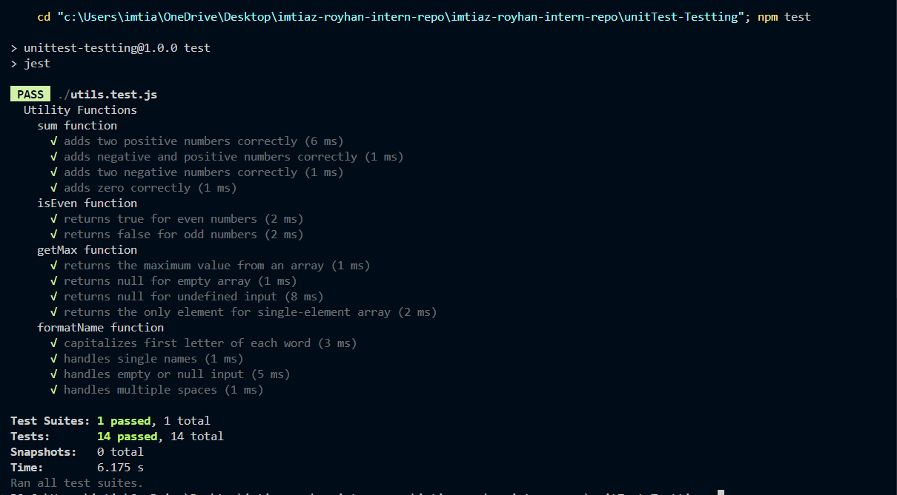

# Unit Testing Reflection

## Why is automated testing important in software development?

Automated testing is crucial in software development because it:

1. **Catches bugs early**: Tests can identify issues before code reaches production, reducing the cost and effort of fixing bugs.
2. **Ensures code quality**: Tests verify that code behaves as expected and meets requirements.
3. **Facilitates refactoring**: With a good test suite, developers can confidently refactor code knowing that tests will catch any regressions.
4. **Documents behavior**: Tests serve as living documentation, showing how components are intended to work.
5. **Speeds up development**: Automated tests run faster than manual testing, especially for regression testing.

## What did you find challenging when writing your first Jest test?

When writing my first Jest test, I found the following aspects challenging:

1. **Understanding mocking concepts**: Learning how to properly mock API calls and external dependencies was initially confusing.
2. **Async testing**: Handling asynchronous code in tests, especially with promises and async/await, required extra attention to detail.
3. **Test structure**: Deciding what to test and how to structure tests in a meaningful way took some practice.

## Why is it important to mock API calls in tests?

Mocking API calls in tests is important because:

1. **Speed**: Mocked API calls are much faster than real network requests, making tests run quicker.
2. **Reliability**: Tests aren't affected by network issues or API downtime.
3. **Control**: Mocks allow us to simulate different scenarios, including error responses and edge cases.
4. **Isolation**: Tests remain focused on the component's behavior rather than external dependencies.

## What are some common pitfalls when testing asynchronous code?

Common pitfalls when testing asynchronous code include:

1. **Not waiting for promises**: Forgetting to properly await asynchronous operations can lead to tests that pass incorrectly.
2. **Race conditions**: Tests may sometimes pass or fail unpredictably due to timing issues.
3. **Incomplete cleanup**: Not properly cleaning up async operations can cause tests to interfere with each other.

## What was the most challenging part of testing Redux?

The most challenging part of testing Redux was understanding how to properly test asynchronous actions (thunks) and ensuring that the middleware was correctly set up in the test environment.

## How do Redux tests differ from React component tests?

Redux tests and React component tests differ in several ways:

1. **Scope**: Redux tests focus on state management logic, while component tests focus on UI behavior.
2. **Dependencies**: Redux tests typically have fewer external dependencies to mock compared to component tests.
3. **Approach**: Redux tests are more straightforward as they involve testing pure functions, whereas component tests often require more complex setup with rendering and user interaction simulation.

Test:
